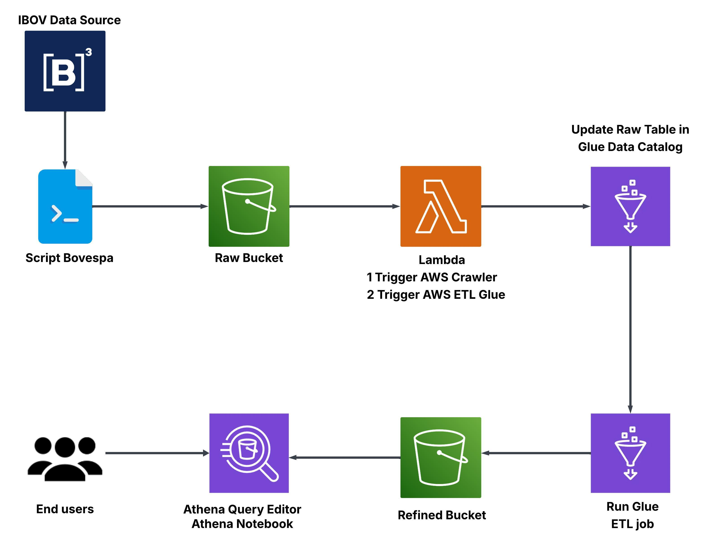

# B3 Scraper

This project automates the collection, processing, and visualization of stock market data from B3 (Brasil Bolsa Balcão), leveraging AWS services for a fully serverless data pipeline.

---

## 🧩 Overview

- Scrapes portfolio data from B3 using a base64-encoded API
- Uploads raw data to Amazon S3 (`raw` layer)
- Uses AWS Lambda to trigger Glue Crawler and Glue Job for processing
- Stores processed data in S3 (`refined` layer) and AWS Glue Data Catalog
- Data is queryable and visualized through Amazon Athena Notebooks

---

## 📁 Architecture



---

## 📦 Features

- Extracts and decodes B3 data programmatically
- Supports incremental ingestion and processing
- Saves files in efficient columnar format (Parquet)
- **Raw data is partitioned by `report_date`**
- **Refined data is partitioned by `report_date` and `share_type`**
- Serverless and event-driven design using AWS Lambda
- Queryable via Athena SQL interface or Notebooks
- Designed for scalability and automation

---

## 🧪 Requirements

- Python 3.9+
- AWS account with access to:
  - S3
  - Lambda
  - Glue (Crawler + Job)
  - Athena
- [Poetry](https://python-poetry.org/) for dependency management

---

## 🚀 Installation

Clone the repository:

```bash
git clone https://github.com/gabrieljoaooo5/b3-scraper.git
cd b3-scraper
